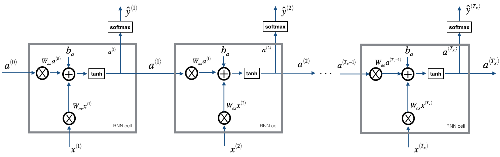

# Character level language model - Dinosaurus Island

Welcome to Dinosaurus Island! 65 million years ago, dinosaurs existed, and in this project they are back. we are in charge of a special task. Leading biology researchers are creating new breeds of dinosaurs and bringing them to life on earth, and our job is to give names to these dinosaurs. If a dinosaur does not like its name, it might go berserk, so choose wisely! 

<table>
<td>


</td>

</table>

Luckily we have learned some deep learning and we will use it to save the day. our assistant has collected a list of all the dinosaur names they could find, and compiled them into this [dataset](dinos.txt). (Feel free to take a look by clicking the previous link.) To create new dinosaur names, we will build a character level language model to generate new names. our algorithm will learn the different name patterns, and randomly generate new names. Hopefully this algorithm will keep us safe from the dinosaurs' wrath! 

in this project we will :

-  store text data for processing using an RNN 
-  synthesize data, by sampling predictions at each time step and passing it to the next RNN-cell unit
-  build a character-level text generation recurrent neural network
-  know Why clipping the gradients is important

We will begin by loading in some functions that we have in `rnn_utils`. Specifically, we have access to functions such as `rnn_forward` and `rnn_backward`.

## 1 - Problem Statement

### 1.1 - Dataset and Preprocessing

read the dataset of dinosaur names, create a list of unique characters (such as a-z), and compute the dataset and vocabulary size. 

* The characters are a-z (26 characters) plus the "\n" (or newline character).
* In this project, the newline character "\n" plays a role similar to the `<EOS>` (or "End of sentence") token.  
    - Here, "\n" indicates the end of the dinosaur name rather than the end of a sentence. 
 
### 1.2 - Overview of the model

Our model will have the following structure: 

- Initialize parameters 
- Run the optimization loop
    - Forward propagation to compute the loss function
    - Backward propagation to compute the gradients with respect to the loss function
    - Clip the gradients to avoid exploding gradients
    - Using the gradients, update our parameters with the gradient descent update rule.
- Return the learned parameters 
    

<caption><center> **Figure 1**: Recurrent Neural Network.

* At each time-step, the RNN tries to predict what is the next character given the previous characters. 
* The dataset $\mathbf{X} = (x^{\langle 1 \rangle}, x^{\langle 2 \rangle}, ..., x^{\langle T_x \rangle})$ is a list of characters in the training set.
* $\mathbf{Y} = (y^{\langle 1 \rangle}, y^{\langle 2 \rangle}, ..., y^{\langle T_x \rangle})$ is the same list of characters but shifted one character forward. 
* At every time-step $t$, $y^{\langle t \rangle} = x^{\langle t+1 \rangle}$.  The prediction at time $t$ is the same as the input at time $t + 1$.
## 2 - Building blocks of the model

In this part, we will build two important blocks of the overall model:
- Gradient clipping: to avoid exploding gradients
- Sampling: a technique used to generate characters

we will then apply these two functions to build the model.
### 2.1 - Clipping the gradients in the optimization loop

In this section we will implement the `clip` function that we will call inside of our optimization loop. 

#### Exploding gradients
* When gradients are very large, they're called "exploding gradients."  
* Exploding gradients make the training process more difficult, because the updates may be so large that they "overshoot" the optimal values during back propagation.

Recall that our overall loop structure usually consists of:
* forward pass, 
* cost computation, 
* backward pass, 
* parameter update. 

Before updating the parameters, we will perform gradient clipping to make sure that our gradients are not "exploding."

#### gradient clipping
We will implement a function `clip` that takes in a dictionary of gradients and returns a clipped version of gradients if needed. 
* There are different ways to clip gradients.
* We will use a simple element-wise clipping procedure, in which every element of the gradient vector is clipped to lie between some range [-N, N]. 
* For example, if the N=10
    - The range is [-10, 10]
    - If any component of the gradient vector is greater than 10, it is set to 10.
    - If any component of the gradient vector is less than -10, it is set to -10. 
    - If any components are between -10 and 10, they keep their original values.


<caption><center> **Figure 2**: Visualization of gradient descent with and without gradient clipping, in a case where the network is running into "exploding gradient" problems. </center></caption>


### 2.2 - Sampling

Now assume that our model is trained. we would like to generate new text (characters). The process of generation is explained in the picture below:


<caption><center> **Figure 3**: In this picture, we assume the model is already trained. We pass in $x^{\langle 1\rangle} = \vec{0}$ at the first time step, and have the network sample one character at a time. </center></caption>
we well implement the `sample` function below to sample characters. we need to carry out 4 steps:

- **Step 1**: Input the "dummy" vector of zeros $x^{\langle 1 \rangle} = \vec{0}$. 
    - This is the default input before we've generated any characters. 
    We also set $a^{\langle 0 \rangle} = \vec{0}$
- **Step 2**: Run one step of forward propagation to get $a^{\langle 1 \rangle}$ and $\hat{y}^{\langle 1 \rangle}$. Here are the equations:

hidden state:  
$$ a^{\langle t+1 \rangle} = \tanh(W_{ax}  x^{\langle t+1 \rangle } + W_{aa} a^{\langle t \rangle } + b)\tag{1}$$

activation:
$$ z^{\langle t + 1 \rangle } = W_{ya}  a^{\langle t + 1 \rangle } + b_y \tag{2}$$

prediction:
$$ \hat{y}^{\langle t+1 \rangle } = softmax(z^{\langle t + 1 \rangle })\tag{3}$$

- Details about $\hat{y}^{\langle t+1 \rangle }$:
   - Note that $\hat{y}^{\langle t+1 \rangle }$ is a (softmax) probability vector (its entries are between 0 and 1 and sum to 1). 
   - $\hat{y}^{\langle t+1 \rangle}_i$ represents the probability that the character indexed by "i" is the next character.  
   - We have provided a `softmax()` function that we can use.
#### Additional information

- $x^{\langle 1 \rangle}$ is `x` in the code. When creating the one-hot vector, make a numpy array of zeros, with the number of rows equal to the number of unique characters, and the number of columns equal to one.  It's a 2D and not a 1D array.
- $a^{\langle 0 \rangle}$ is `a_prev` in the code.  It is a numpy array of zeros, where the number of rows is $n_{a}$, and number of columns is 1.  It is a 2D array as well.  $n_{a}$ is retrieved by getting the number of columns in $W_{aa}$ (the numbers need to match in order for the matrix multiplication $W_{aa}a^{\langle t \rangle}$ to work.
- [numpy.dot](https://docs.scipy.org/doc/numpy/reference/generated/numpy.dot.html)
- [numpy.tanh](https://docs.scipy.org/doc/numpy/reference/generated/numpy.tanh.html)
#### Using 2D arrays instead of 1D arrays
* You may be wondering why we emphasize that $x^{\langle 1 \rangle}$ and $a^{\langle 0 \rangle}$ are 2D arrays and not 1D vectors.
* For matrix multiplication in numpy, if we multiply a 2D matrix with a 1D vector, we end up with with a 1D array.
* This becomes a problem when we add two arrays where we expected them to have the same shape.
* When two arrays with  a different number of dimensions are added together, Python "broadcasts" one across the other.
* you will find some sample code that shows the difference between using a 1D and 2D array.
- **Step 3**: Sampling: 
    - Now that we have $y^{\langle t+1 \rangle}$, we want to select the next letter in the dinosaur name. If we select the most probable, the model will always generate the same result given a starting letter. 
        - To make the results more interesting, we will use np.random.choice to select a next letter that is likely, but not always the same.
    - Sampling is the selection of a value from a group of values, where each value has a probability of being picked.  
    - Sampling allows us to generate random sequences of values.
    - Pick the next character's index according to the probability distribution specified by $\hat{y}^{\langle t+1 \rangle }$. 
    - This means that if $\hat{y}^{\langle t+1 \rangle }_i = 0.16$, we will pick the index "i" with 16% probability. 
    - we can use [np.random.choice](https://docs.scipy.org/doc/numpy-1.13.0/reference/generated/numpy.random.choice.html).

    Example of how to use `np.random.choice()`:
    ```python 
    np.random.seed(0)
    probs = np.array([0.1, 0.0, 0.7, 0.2])
    idx = np.random.choice([0, 1, 2, 3] p = probs)
    ```
    - This means that we will pick the index (`idx`) according to the distribution: 

    $P(index = 0) = 0.1, P(index = 1) = 0.0, P(index = 2) = 0.7, P(index = 3) = 0.2$.

    - Note that the value that's set to `p` should be set to a 1D vector.
    - Also notice that $\hat{y}^{\langle t+1 \rangle}$, which is `y` in the code, is a 2D array.
##### Additional information
- [range](https://docs.python.org/3/library/functions.html#func-range)
- [numpy.ravel](https://docs.scipy.org/doc/numpy/reference/generated/numpy.ravel.html) takes a multi-dimensional array and returns its contents inside of a 1D vector.
```Python
arr = np.array([[1,2],[3,4]])
print("arr")
print(arr)
print("arr.ravel()")
print(arr.ravel())
```
Output:
```Python
arr
[[1 2]
 [3 4]]
arr.ravel()
[1 2 3 4]
```

- **Step 4**: Update to $x^{\langle t \rangle }$ 
    - The last step to implement in `sample()` is to update the variable `x`, which currently stores $x^{\langle t \rangle }$, with the value of $x^{\langle t + 1 \rangle }$. 
    - we will represent $x^{\langle t + 1 \rangle }$ by creating a one-hot vector corresponding to the character that we have chosen as our prediction. 
    - we will then forward propagate $x^{\langle t + 1 \rangle }$ in Step 1 and keep repeating the process until we get a "\n" character, indicating that we have reached the end of the dinosaur name. 


## 3 - Building the language model 

It is time to build the character-level language model for text generation. 


### 3.1 - Gradient descent 

* In this section you will implement a function performing one step of stochastic gradient descent (with clipped gradients). 
* You will go through the training examples one at a time, so the optimization algorithm will be stochastic gradient descent. 

As a reminder, here are the steps of a common optimization loop for an RNN:

- Forward propagate through the RNN to compute the loss
- Backward propagate through time to compute the gradients of the loss with respect to the parameters
- Clip the gradients
- Update the parameters using gradient descent 

 Implement the optimization process (one step of stochastic gradient descent). 

The following functions are provided:

```python
def rnn_forward(X, Y, a_prev, parameters):
    """ Performs the forward propagation through the RNN and computes the cross-entropy loss.
    It returns the loss' value as well as a "cache" storing values to be used in backpropagation."""
    ....
    return loss, cache
    
def rnn_backward(X, Y, parameters, cache):
    """ Performs the backward propagation through time to compute the gradients of the loss with respect
    to the parameters. It returns also all the hidden states."""
    ...
    return gradients, a

def update_parameters(parameters, gradients, learning_rate):
    """ Updates parameters using the Gradient Descent Update Rule."""
    ...
    return parameters
```

Recall that we previously implemented the `clip` function:

```Python
def clip(gradients, maxValue)
    """Clips the gradients' values between minimum and maximum."""
    ...
    return gradients
```
#### parameters

* Note that the weights and biases inside the `parameters` dictionary are being updated by the optimization, even though `parameters` is not one of the returned values of the `optimize` function. The `parameters` dictionary is passed by reference into the function, so changes to this dictionary are making changes to the `parameters` dictionary even when accessed outside of the function.
* Python dictionaries and lists are "pass by reference", which means that if we pass a dictionary into a function and modify the dictionary within the function, this changes that same dictionary (it's not a copy of the dictionary).

### 3.2 - Training the model 
* Given the dataset of dinosaur names, we use each line of the dataset (one name) as one training example. 
* Every 100 steps of stochastic gradient descent, we will sample 10 randomly chosen names to see how the algorithm is doing. 
* shuffle the dataset, so that stochastic gradient descent visits the examples in random order. 

implement `model()`. When `examples[index]` contains one dinosaur name (string), to create an example (X, Y), we can use this:

##### Set the index `idx` into the list of examples
* Using the for-loop, walk through the shuffled list of dinosaur names in the list "examples".

##### Extract a single example from the list of examples
* `single_example`: use the `idx` index that we set previously to get one word from the list of examples.
##### Convert a string into a list of characters: `single_example_chars`
* `single_example_chars`: A string is a list of characters.
* we can use a list comprehension (recommended over for-loops) to generate a list of characters.
```Python
str = 'I love learning'
list_of_chars = [c for c in str]
print(list_of_chars)
```

```
['I', ' ', 'l', 'o', 'v', 'e', ' ', 'l', 'e', 'a', 'r', 'n', 'i', 'n', 'g']
```
##### Convert list of characters to a list of integers: `single_example_ix`
* Create a list that contains the index numbers associated with each character.
* Use the dictionary `char_to_ix`
##### Create the list of input characters: `X`
* `rnn_forward` uses the `None` value as a flag to set the input vector as a zero-vector.
* Prepend the `None` value in front of the list of input characters.
* There is more than one way to prepend a value to a list.  One way is to add two lists together: `['a'] + ['b']`
##### Get the integer representation of the newline character `ix_newline`
* `ix_newline`: The newline character signals the end of the dinosaur name.
    - get the integer representation of the newline character `'\n'`.
    - Use `char_to_ix`
##### Set the list of labels (integer representation of the characters): `Y`
* The goal is to train the RNN to predict the next letter in the name, so the labels are the list of characters that are one time step ahead of the characters in the input `X`.
    - For example, `Y[0]` contains the same value as `X[1]`  
* The RNN should predict a newline at the last letter so add ix_newline to the end of the labels. 
    - Append the integer representation of the newline character to the end of `Y`.

We observe our model outputting random-looking characters at the first iteration. After a few thousand iterations, our model should learns to generate reasonable-looking names. 


    
## Conclusion

We can see that our algorithm has started to generate plausible dinosaur names towards the end of the training.  Our implementation generated some really cool names like `maconucon`, `marloralus` and `macingsersaurus`. Our model hopefully also learned that dinosaur names tend to end in `saurus`, `don`, `aura`, `tor`, etc.

If our model generates some non-cool names, don't blame the model entirely--not all actual dinosaur names sound cool. (For example, `dromaeosauroides` is an actual dinosaur name and is in the training set.) But this model should give us a set of candidates from which we can pick the coolest! 
We ran our dinosaur name for quite some time, and so far our favorite name is the great, undefeatable, and fierce: Mangosaurus!


    
## 4 - Writing like Shakespeare


A similar (but more complicated) task is to generate Shakespeare poems. Instead of learning from a dataset of Dinosaur names we can use a collection of Shakespearian poems. Using LSTM cells, we can learn longer term dependencies that span many characters in the text--e.g., where a character appearing somewhere a sequence can influence what should be a different character much much later in the sequence. These long term dependencies were less important with dinosaur names, since the names were quite short. 


<caption><center> Let's become poets! </center></caption>

We have implemented a Shakespeare poem generator with Keras.we already trained a model for ~1000 epochs on a collection of Shakespearian poems called [*"The Sonnets"*](shakespeare.txt). 
We'll train the model for one more epoch. When it finishes training for an epoch,we can run `generate_output`, which will prompt asking us for an input (`<`40 characters). The poem will start with our sentence, and our RNN-Shakespeare will complete the rest of the poem for us! 

The RNN-Shakespeare model is very similar to the one we have built for dinosaur names. The only major differences are:
- LSTMs instead of the basic RNN to capture longer-range dependencies
- The model is a deeper, stacked LSTM model (2 layer)
- Using Keras instead of python to simplify the code 

**References**:
- This project took inspiration from Andrej Karpathy's implementation: https://gist.github.com/karpathy/d4dee566867f8291f086. To learn more about text generation, also check out Karpathy's [blog post](http://karpathy.github.io/2015/05/21/rnn-effectiveness/).
- For the Shakespearian poem generator, our implementation was based on the implementation of an LSTM text generator by the Keras team: https://github.com/keras-team/keras/blob/master/examples/lstm_text_generation.py 
